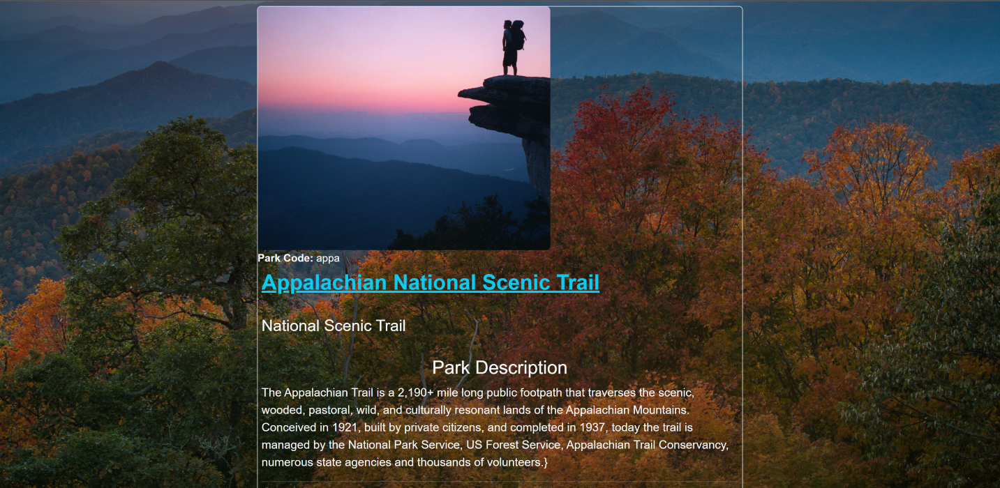
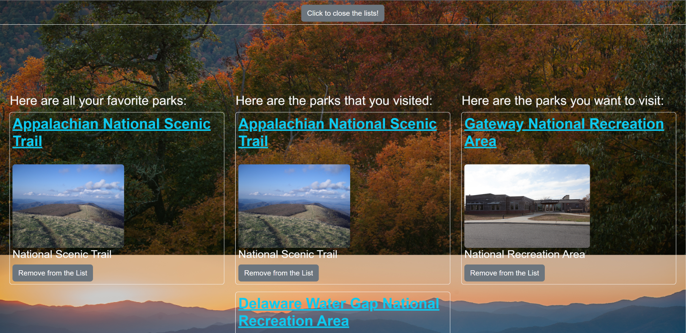
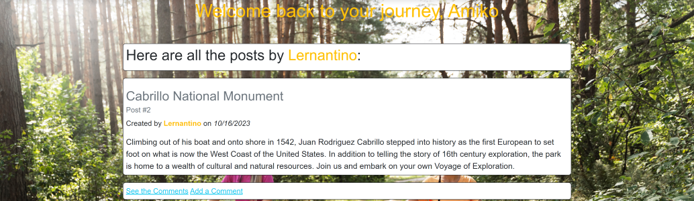

# TrailBlazer

## Description

This full-stack web app is meant to aid people with a high interest in nature and the outdoors find new places (and rediscover old ones) where they can carry out their favorite activities. The functionality to search for parks by state, topics, and activities (we make fetch requests to the National Park Services API) and to make lists of favorites, visited, and want-to-visit parks and be able to update them is available to both members and not members alike. The main difference, apart from a different UI, is that non-members can only store their data on the client-side (localStorage), while members' data is stored in a relational MySQL database (courtesy of JawsDB). In addition, members (called "explorers" within the site) can exchange posts, comments, and lists with each other within a CMS-style blog. They can also subscribe to a mailing list and are able to change their password or to cancel their membership at any time. The idea is that the site will offer a wealth of information about natural parks and the things you can do in them as well as to create a sense of community among fellow "explorers".

For the collaborators, the challenge was an instructive way to :

1. Keep practicing modularization as a way to implement separation of concerns. In this case we are following the MVC (Model-View-Controller) and we are coding both the front- and the back-end of the application.

2. Continue learning about the connection between different methods of request (get, post, put, and delete) using the Fetch API on the front-end and the different routes defined on the back-end. The increased number of routes and the more complex logic required for conditional renderings of particular views vastly increase the difficulty of connecting those two sides of the coin.

3. Keep using Sequelize models to make CRUD operations on the database.

4. The use of templating engines, in particular "handlebars", for producing views on the front-end instead of utilizing regular html documents.

5. The use of validators and methods of encryption for information submitted in login and signup forms and the creation of sessions with metadata stored in cookies whose duration you can stipulate.

6. Using Bootstrap components and utilities/classes to create a simple, attractive, and responsive UI.

## Table of Contents

- [Installation](#installation)
- [Usage](#usage)
- [Credits](#credits)
- [License](#license)

## Installation

N/A: The full stack application is actually a website deployed to Heroku. See "Credits" section for more information. We built the app using the officially supported Heroku Node.js buildpack and the remote MySQL database ("trails_db") was created using the JawsDB add-on. The db was seeded by running the command "heroku run node  seeds/index.js" to populate the tables from the Heroku CLI.

## Usage

Disclaimer: Screenshots present the website as rendered on the Google Chrome Version 116.0.5845.188 (Official Build) (64-bit), run in a Windows 11 Home Version 22H2 environment.

1.By navigating to the Heroku URL <https://a-new-trail-blazer-e459cac1a517.herokuapp.com/>, the user will be presented with the following view:

2.Once you select a state, you can get a description of the features/benefits of the site together with select menus to see all the parks from that state (filtered so you can do hiking, biking, watersports, or camping) or to look for parks across the U.S. territories by activities or topics, with emphasis on nature-related activities:

3.If you select a park from a particular state, a modal show up with info about it:

4.Within that modal, you have the option to make another modal appear showing the activities recommended by the park's administration:

5.If instead you choose either an activity or a topic from the respective select menus, a lists of related national parks show-up, with official external links:

 

6.At the bottom of the modal for each particular park, you can see buttons to add the park to your favorites, visited ("Been There!"), and want-to-visit ("Bucket List!") lists. The aforementioned "Things To Do" modal shows up when you click the self-titled button. Of course, there's also a button to close the park's modal:

7.As an example, this shows the message displayed when you add a park to favorites:

8.This image shows the warning message that appears when you try to update a park's status, meaning you are taking it from a list and putting it on another:

9.For non-members, the lists with dynamically rendered parks can be made to appear at the bottom of the page by pressing the lowest-placed button:

10.When you click the login option at the top right of the nav bar, this is what appears:

11.If instead you choose the last link (from left to right), the signup view will show up:

12.Successfull submitting either form will take you to your dashboard:

For an already established user/explorer. All the posts by the logged-in user are displayed.

For a new user/explorer.

13.On the bottom half of the dashboard, you will see options to subscribe to a mailing list by entering a password (or unsubscribe if you were subscribed), to change your password, and to cancel your membership:

14.The logged-in explorer will have the option to add a new post:

15.You can see all of your comments (to all posts):

16.You can edit any of your comments:

17.You can see all currently available posts by all explorers:

Notice that if the post is yours, you can edit it on spot.

18.You can search all currently enrolled explorers to retrieve (but not edit) their posts, comments, and lists:

As an example, here you can view the posts by a fellow explorer.

19.You can add comments to any posts:

20.You can also search for parks pretty much as you could in the non-members section:

Notice the links to the "Favorites", "Been There", and "Bucket List" pages. All of the data needed to render the card items of the corresponding lists is stored in the database.

As an example, this is the "Favorites" list of a particular user accessed from her dashboard. In that case, she is able to delete items from the list.

On the other hand, you cannot delete/update items from other people's lists.

21.If you try to access any endpoint for wich there is no route, a custom 404 page gets rendered:

## Credits

The project is of the joint authorship of Jonathan Maldonado, Jim Buckley, Rodrigo Rivera, and Maitree Patel.

The GitHub repo can be found at: <https://github.com/jimbuckley412/TrailBlazer> .

The app is deployed on Heroku at: <https://a-new-trail-blazer-e459cac1a517.herokuapp.com/>.

The .gitignore file was lifted from the GitLab class repo found at: <https://git.bootcampcontent.com>.

The front-end part employs the Bootstrap CSS framework. A minimized version of its library and of the scripts it uses can be found below:

1. CSS library: <https://cdn.jsdelivr.net/npm/bootstrap@5.2.3/dist/css/bootstrap.min.css>

2. Main script Bootstrap script file: <https://cdn.jsdelivr.net/npm/bootstrap@5.2.3/dist/js/bootstrap.min.js>

3.Associated scripts required for modal functionality: <https://cdn.jsdelivr.net/npm/@popperjs/core@2.9.2/dist/umd/popper.min.js>

We also used the third-party API Boxicon to be able to render a few login-related icons: <https://unpkg.com/boxicons@2.1.4/css/boxicons.min.css>

The folder structure of the project and the helper functions and custom middleware found in the "utils" has been adapted from those found in the activities and Mini-Project for the Module 14 of the Rutgers Full Stack Bootcamp.

This app works in the Node.js JavaScript runtime environment. The latest stable (recommended version) can be found at: <https://nodejs.org/en/download>

We use npm for the specification (semantic versioning) of the app's dependencies and their installation. Here is the URL for the official site of the npm registry: <https://www.npmjs.com>
Here are the dependencies for the development and production environments that we added, including links to find their most recent versions:

Dev-dependencies:

1. Nodemon: "^2.0.3". Used to continuously track the changes to the .js and .json file while coding and debugging, so as not to have to manually stop and restart the express server from listening at the designated port after each change.
<https://www.npmjs.com/package/nodemon>

Dependencies:

1. Express: "^4.17.1". In order to create and work with servers, middleware, routers, etc.
<https://www.npmjs.com/package/express>

2. DotEnv: "^8.2.0". Employed so that we can configure our connections to the database without hardcoding sensititive information that could get compromised by storing the data in environmental variables.
<https://www.npmjs.com/package/dotenv>

3. MySQL2: "^2.1.0". Used to create a connection to and make queries to the database without having to log to the MySQL shell and enter the queries through its CLI, but instead using scripts in JS files.
<https://www.npmjs.com/package/mysql2>

4. Sequelize:"^5.21.7". ORM (Object Relational Mapping) package that synchronizes JS (ES6 specification) classes to the database in order to perform CRUD operations in said database and establish associations(realations) between tables using scripts instead of SQL commands (unless we deem convenient or necessary to use literals).
<https://www.npmjs.com/package/sequelize>

5. Bcrypt: "^5.0.0". We use two methods from this package: bcrypt.hash employs a salting-and-hashing algorithm to encrypt new passwords added to the db during sign-up and bcrypt.compareSync to authenticate the password input for a username that appears in one of the db's records.
<https://www.npmjs.com/package/bcrypt>

6. Express-Session: "^1.17.1". Allows us to save and destroy login sessions by particular users meeting the authorization criteria. It offers many options in terms of cookie settings and allowed protocols, etc.
<https://www.npmjs.com/package/express-session>

7. Connect-Session-Sequelize: "^7.0.4". Facilitates linking the sequelize models to the current login session in order to perform CRUD operations on the db through ORMs while the session lasts. Allows the creation of a Sequelize store.
<https://www.npmjs.com/package/connect-session-sequelize>

8. Express-Handlebars: "^5.2.0". A package that simplifies setting and using the Handlebars template engine while also using an Express server and routers to create RESTful routes.
<https://www.npmjs.com/package/express-handlebars>

## How to Contribute

If you want to contribute, feel free to fork the repo, modify the repo on your local machine and then open a pull request. That way I can review the changes before deciding whther to merge them in the codebase or not.

## Tests

The app was manually tested multiple times before deployment by its author, checking for errors both in the browser's (Google Chrome DevTools for the front end) console and in the terminal (Git Bash for the back end). Before connecting the back-end to the front-end, some endpoints were tested using Insomnia 2023.5.17 as a client.

However, the user should keep an eye for any error thrown in the console and, if possible, open an issue in the GitHub repo detailing the bug.

In the future, we think a major re-assessment of the code will be necessary in order to make it conform to the DRY paradigm, thereby aiding in maintaining and debugging it.

## Questions

The GitHub profile name of Jonathan Maldonado is "jguemarez" and you can checkout his profile at: <https://www.github.com/jguemarez>.
For further questions and comments, you can mail him to the following address: <cantor.dedekind112358@gmail.com>.

## License

This is an open-source project under the terms of agreement provided by the MIT license.
For more information, click on the following link: <https://opensource.org/license/mit>
